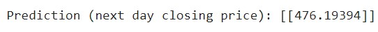
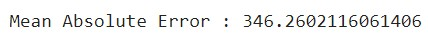

# Stock_Prediction
## Introduction 
The act of attempting to anticipate the future value of a business stock or other financial instrument traded on an exchange is known as stock market prediction. A successful forecast of a stock's future price could result in a large profit. Stock prices, according to the efficient-market theory, represent all currently accessible information, and any price fluctuations that are not based on newly revealed information are thus fundamentally unpredictable.

Stock Price Prediction using machine learning helps us discover the future value of company stock and other financial assets traded on an exchange.Predicting the market is challenging because the future is inherently unpredictable.Multiple (macro and micro) aspects, such as politics, global economic conditions, unforeseen events, a company's financial performance, and so on, make accurate stock price forecast extremely difficult.

We are using Long Short-Term Memory (LSTM) method to create a Machine Learning model to forecast  the price of the share of a company. Long-term memory (LSTM) is a deep learning artificial recurrent neural network (RNN) architecture.

## Dataset
The datasets utilised in this project are stock prices from companies like SBIN over the last seven years. The LSTM model is trained and tested using these datasets. yfinance is used to get these datasets directly..yfinance is an open-source tool that uses Yahoo's publicly available APIs, and is intended for research and educational purposes.

The dataset mainly includes : Date, Open, High, Low, Close, Adj Close and Volume

For training and testing reasons, the stock's close price on a daily basis, excluding weekends, is used. The first five years of the Close price are utilized for model training, while the last two years are used for model testing.
The dataset can be simply customised by the user to suit their needs. It is possible to increase or reduce the number of years taken into account. The greater the number of datasets considered, the better the outcomes.

## Implementation
The implementation part consist of several steps :- 

--> Loading the data

--> Preparing or preprocessing the data

--> Building the model

--> Loading the test data

--> Making Predictions on test data

--> Plotting the test predictions

--> Predicting the next day closing price

--> Computing the R-squared (R^2) and Adjusted R-squared (R^2) in percentage

--> Computing the Mean Absolute Error(MAE)

## Sample
### Stock - SBIN

Actual closing price : 492.4

As we can see from above graph, the predicted prices and the actual prices are similar with a small range of difference and the adjusted r^2 value is above 90% for various company stocks.Mean Adjusted Error has a massive value, this is expected as we cannot get 100% accuracy.Hence, this model delivers a good performance.

## References
https://www.youtube.com/watch?v=lncoLfue_Y4

https://www.analyticsvidhya.com/blog/2018/10/predicting-stock-price-machine-learningnd-deep-learning-techniques-python/

https://www.simplilearn.com/tutorials/machine-learning-tutorial/stock-price-prediction-using-machine-learning

https://www.analyticsvidhya.com/blog/2021/10/machine-learning-for-stock-market-prediction-with-step-by-step-implementation/
